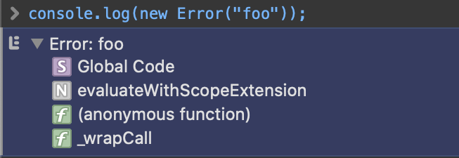
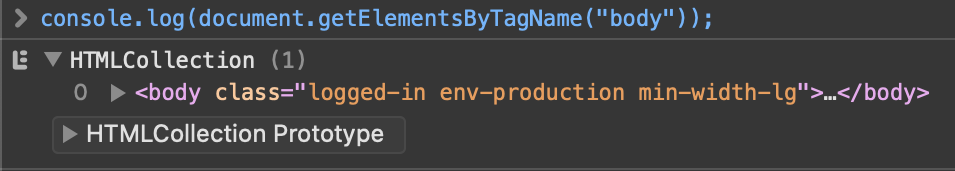
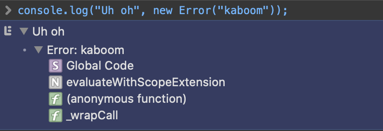

# purescript-console-extra

Unconstrained access the JS console.

## Difference from purescript-console

Console functions from the
[purescript-console](https://github.com/purescript/purescript-console)
project are defined to operate only on strings. The `show` (e.g
`logShow`) variations are more generic, but still operate by using the
`Show` instance of the argument to build a string, to which the
respective console function is invoked on.

While this achieves the basic logging requirements, many JS
environments implement far richer logging capabilities.

For instance, logging an `Error` in browsers also emits a stack trace.



Logging a DOM element emits a DOM tree that can further be
inspected.



Multiple arguments can also be given to a console invocation.



This project aims to expose those capabilities.

## Logging a single argument

Log functions in `purescript-console-extra` accept any type as
input. Printing is deferred to the underlying console environment.

``` purescript
log :: forall a. a -> Effect Unit
```

## Logging multiple arguments

Each log level also has a multiple argument variation.

``` purescript
log' :: forall a. Array a -> Effect Unit
```

Note that calling `log` and `log'` on arrays translate to different
console calls.

| Purescript | Javascript |
| ---------- | ---------- |
| `log [1,2,3]` | console.log([1, 2, 3]) |
| `log' [1,2,3]` | console.log(1, 2, 3) |

A limitation of the `log'` is that all elements should be of the same
type.

Given the following definition:

``` purescript
someError :: Effect.Exception.Error
```

The following won't work:

``` purescript
log' [ "Uh oh"   -- type is String
     , someError -- type is Error
     ]
```

A workaround is to declare both as `Foreign`.

``` purescript
log' [ unsafeToForeign "Uh oh"
     , unsafeToForeign someError
     ]
```

Alternatively, the library also offers `log2` and `log3` variations to
conveniently call `log'` for 2 and 3 arguments repsectively.
